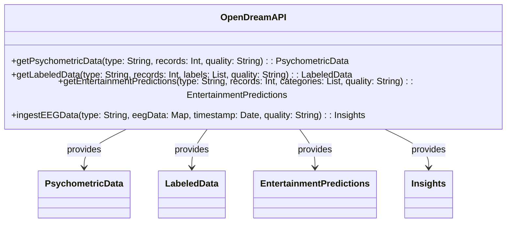

# OpenDream API Documentation

## Overview

OpenDream API is a robust interface designed to provide structured access to various psychometric data, including EEG, labels, Facial Expressions, Pupil Movements, FMRI, and more. It ensures fast response times and returns structured JSON data in line with RESTful API standards.

## Root Path Prefix

The root path prefix for all endpoints in this API is `/opendream/v1/`.

## API Endpoints

### 1. Fetch Psychometric Data

```url
GET /opendream/v1/data.json?type={dataType}&records={numberOfRecords}&quality={dataQuality}
```

#### Parameters:

- `type`: The type of psychometric data to be fetched.
- `records`: Number of records to fetch.
- `quality`: Accepted quality of data. 

#### Example Response:

```json
{
  "type": "EEG",
  "data": [
    {
      "timestamp": "2023-11-10T12:00:00Z",
      "values": { "channel1": "value1", "channel2": "value2", ... }
    },
    ...
  ],
  "link": "https://opendream.org/data/eeg"
}
```

### 2. Fetch Labeled Psychometric Data

```url
GET /opendream/v1/labeled_data.json?type={dataType}&records={numberOfRecords}&labels={labelList}&quality={dataQuality}
```

#### Parameters:

- `type`: The type of labeled psychometric data to be fetched.
- `records`: Number of labeled records to fetch.
- `labels`: Comma-separated list of labels associated with the data to be fetched.
- `quality`: Accepted quality of data. 

#### Example Response:

```json
{
  "type": "EEG",
  "data": [
    {
      "timestamp": "2023-11-10T12:00:00Z",
      "label": "Happy",
      "values": { "channel1": "value1", "channel2": "value2", ... }
    },
    ...
  ],
  "link": "https://opendream.org/data/labeled/eeg"
}
```

### 3. AI Feature Data: Entertainment Predictions

Access enriched data pertaining to user preferences on movies, TV shows, and games, categorized by different user archetypes.

```url
GET /opendream/v1/entertainment_predictions.json?type={dataType}&records={numberOfRecords}&categories={categoryList}&quality={dataQuality}
```

#### Parameters:

- `type`: The type of prediction data to be fetched.
- `records`: Number of prediction records to fetch.
- `categories`: Comma-separated list of entertainment categories like movies, TV shows, games, etc.
- `quality`: Accepted quality of data.

#### Example Response:

```json
{
  "type": "Movie",
  "data": [
    {
      "timestamp": "2023-11-10T12:00:00Z",
      "predictions": {
        "reviews": "Positive",
        "favoriteScenes": "Climax",
        "leastFavoriteActors": "Actor1"
      }
    },
    ...
  ],
  "link": "https://opendream.org/data/predictions/movie"
}
```

### 4. Ingest EEG Data and Retrieve Insights

Ingest EEG or brain data and get insights in the form of text, images, music, and emotions. 

```url
POST /opendream/v1/ingest_eeg.json?type={dataType}&eegData={eegData}&timestamp={timestamp}&quality={dataQuality}
```

#### Parameters:

- `type`: The type of EEG data being ingested.
- `eegData`: The EEG data to be ingested.
- `timestamp`: The timestamp associated with the EEG data.
- `quality`: Accepted quality of data. 

#### Example Response:

```json
{
  "type": "EEG",
  "insights": {
    "text": "The user is feeling happy",
    "images": ["image1_url", "image2_url"],
    "music": ["song1_url", "song2_url"],
    "emotions": ["happy", "excited"]
  },
  "link": "https://opendream.org/data/insights/eeg"
}
```

## Diagram



## Rate Limiting and Performance

The API employs rate limiting to maintain optimal performance, ensuring sub 200ms response times at the 95th percentile, with a target to return all requests within 1 second.

## Regions, Scalability, and Usage Monitoring

OpenDream API is designed for global availability and scalability with extensive monitoring to ensure optimal performance and security.

## Conclusion

The OpenDream API offers diverse and versatile solutions for accessing a wide range of psychometric and EEG data. It caters to various user needs, offering raw and labeled psychometric data, AI-processed feature data for entertainment preferences, and insights derived from the ingested EEG data, enabling users to delve deep into the intricacies of psychometric studies and analyses.